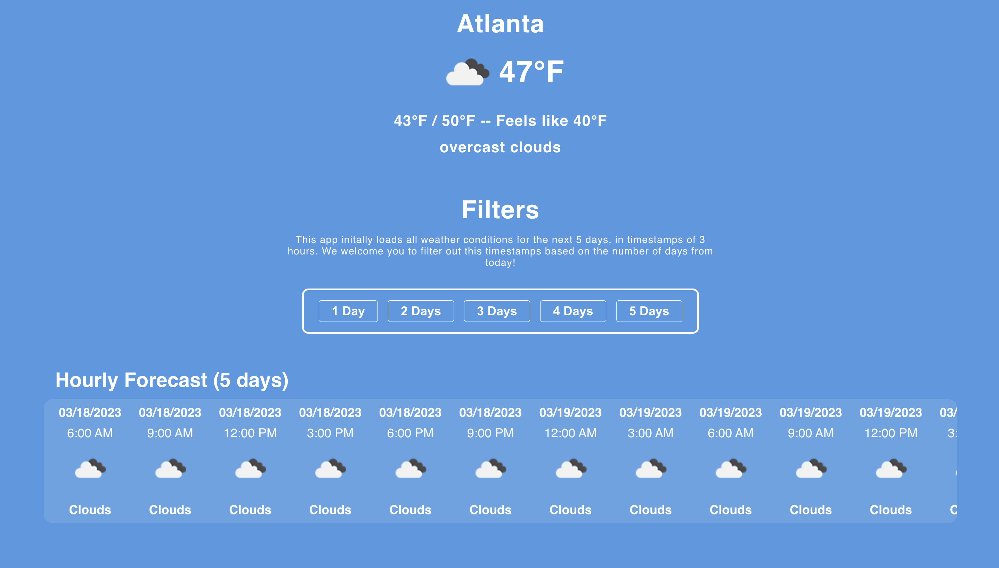

## Practical React -  Weather App Activity

### :atom_symbol: Introduction 
This code repository contains the starter code for the coding portion of our *Practical React Workshop* (Spring 2023). Here, the following concepts in React will be used to implement a basic weather application:
* JSX
* Components
* State
* Conditional Rendering
* Rendering Lists
* Hooks (`useState` and `useEffect`) 

You can refer to our [workshop slides](https://docs.google.com/presentation/d/1gEppHNplM2Ox5mp3CvtPqkk8cDMq8v6YwbXSFWTdI80/edit?usp=sharing) if you are unsure about any of these concepts.
 
### :desert_island: Getting Started - CodeSandbox
1. Create an account with [CodeSandbox](https://codesandbox.io/?from-app=1), a web-accessible coding environment where you can pull from and update code repositories online without setting up anything on your device.
2. Click [this link](https://codesandbox.io/p/github/gt-webdev/practical-react-weather-app/main?file=%2FREADME.md&workspace=%257B%2522activeFileId%2522%253A%2522clfd75rm3000ig6i43bad4iwv%2522%252C%2522openFiles%2522%253A%255B%2522%252FREADME.md%2522%255D%252C%2522sidebarPanel%2522%253A%2522EXPLORER%2522%252C%2522gitSidebarPanel%2522%253A%2522COMMIT%2522%252C%2522spaces%2522%253A%257B%2522clfd75st400153b6icb1nsoez%2522%253A%257B%2522key%2522%253A%2522clfd75st400153b6icb1nsoez%2522%252C%2522name%2522%253A%2522Default%2522%252C%2522devtools%2522%253A%255B%257B%2522key%2522%253A%2522clfdgtw6f000t3b6jj18x5hwc%2522%252C%2522type%2522%253A%2522PROJECT_SETUP%2522%252C%2522isMinimized%2522%253Afalse%257D%255D%257D%257D%252C%2522currentSpace%2522%253A%2522clfd75st400153b6icb1nsoez%2522%252C%2522spacesOrder%2522%253A%255B%2522clfd75st400153b6icb1nsoez%2522%255D%252C%2522hideCodeEditor%2522%253Afalse%257D) to get started with our activity!

### :wrench: Getting Started - Github
> **Note:** Please make sure you have node and npm installed onto your device if you plan on cloning this repository through git.

1. Clone this repository onto your device with the following command through the command-line: 
```bash
git clone https://github.com/gt-webdev/practical-react-weather-app.git
cd practical-react-weather-app
```
2.  Execute this command to install any dependencies necessary for this project.
```bash
npm install
```
3. Now, you can enter the following command in your terminal to run your app. 
```
npm run start
```

### :apple: About our Weather app
> **Goal:** We want to be able to model our app to look similar to the completed example in this image: 



The following components are provided to you.
- `CurrentWeatherDisplay`: displays the current weather and temperatures. 
- `Filters`: a container of five `FilterButton` components.
- `ForecastDisplay`: a container that will display all the upcoming weather forecasts returned by an API call (see below)
- `App`: the component that contains all of the above 

The CSS for these components will also be included with the starter code for this activity. Feel free to modify these files and/or use them in your implementation of the app.

We have also defined API calls to the [OpenWeatherMap API](https://openweathermap.org/api) in the `lib/weatherLib.js` file.  You will be invoking the following functions from this file when completing your app:

1. `fetchHourlyData()`: returns an array of forecast items, each containing a `date`, `time`, weather `condition`, and `icon` for a timestamp.

Example output:
```json
[
	{
		
		"date": "03/18/2023",
		"time": "6:00 AM",
		"condition": "Clouds",
		"icon": "04d",
	},
	{
	    "time": "3:00 AM",
	    "date": "03/23/2023",
	    "condition": "Clouds",
	    "icon": "04n"
	}
]
```
2. `fetchCurrentWeather(isFahrenheit)`: returns an object containing relevant data for current weather. If the `isFahrenheit` input is set to `true`, all temperature values will be presented in °F or otherwise in °C.

Example output: 
```json
{
    "city": "Atlanta",
    "icon": "04n",
    "condition": "overcast clouds",
    "temp": "45°F",
    "min_temp": "41°F",
    "max_temp": "48°F",
    "feels_like": "38°F"
}
```
> **Important Note**: The `icon` attribute in these outputs contain a three-character string. To retrieve its corresponding image, simply place it into the url: `https://openweathermap.org/img/wn/{icon}@.png`, replacing `{icon}`  with your icon value.
> ```jsx
> const icon = "04n";
> return 
> ```

### :pencil: Tasks
To help build out your weather application, you will need to achieve the following tasks: 

 - [ ] Remove hard-coding from `CurrentWeatherDisplay`
 - [ ] Conditionally render Celsius or Temperature in `CurrentWeatherDisplay`
 - [ ] Create a component to represent forecast items
 - [ ] Apply filtering to forecast data

#### Task #1: Remove hard-coding from `CurrentWeatherDisplay`
We have that the `CurrentWeatherDisplay` is hardcoded with a city name, weather condition, and temperature values (in Fahrenheit). 

However,  we would like to have this component receive current weather data (with Fahrenheit temperatures) during its *mounting* stage and render these values into its JSX.

> Hint: Think about how we can execute some code (e.g. function calls, API calls, or setting variables) at certain stages in a component's lifecycle, especially during a component's *mounting* stage.

#### Task #2: Conditionally render Celsius or Temperature in `CurrentWeatherDisplay`
Now that you have populated the `CurrentWeatherDisplay` component with values from your API call, we would like you to conditionally render the temperatures between Fahrenheit and Celsius. 

Create a state to keep track of which temperature you'll be displaying and a button to toggle this state between °F and °C. Depending on this state, conditionally render the appropriate temperature to your JSX.

> Note: You can directly alter the output of `fetchCurrentWeather()` with this state, and render its output. However, we would like you to make use of conditional rendering to complete this task. 

Two states: `currentWeatherFahrenheit` and `currentWeatherCelsius` have been provided for you. Use the values of these two states to conditionally render °F and °C for your temperature values.

#### Task #3: Create a component to represent forecast items
The `ForecastDisplay` does not present any forecasts. Retrieve a list of forecast data from `fetchHourlyData()`, and within `ForecastDisplay`, create a child custom component `ForecastItem` for each element on this list. 

> Hint: You'll need to do two things  here:
> 1. Create `ForecastItem` in another file and think about what kinds of props (if any) would need to be inputted into this component.
> 2. Return this component for each element in the result of `fetchHourlyData()` inside your `ForecastDisplay` component. Make sure you are passing in props into your `ForecastItem` components! (if you require any).

#### Task #4: Apply filtering to forecast data
We have that the `Filters` component contains five `FilterButton`s. Each of these buttons should filter your forecast data to retrieve all forecast items within `x` amount of days from the time of the API call. For example, the `2 Days` filter button should have your data return all forecast timestamps presented within two days of making the API call.

However, we have that these buttons perform no filtering at all since each of these buttons includes a state `isActive`, without `App` or the other `FilterButtons` knowing what filter is active. 

> Hint #1: You will need to *lift state* from the `FilterButton` to an appropriate parent/ancestor. Think about *what data* will be impacted by filtering and *which component contains this*. Then, raise state to their 
> - Remember: if a parent contains some state (e.g. `name`), it can share this state (and even its setState) to its child components by passing the state through props.
```jsx
function Parent() {
	const [name, setName] = useState("");
	return (
		<FirstChild childName={name} setChildName={setChildName}/>
		<AnotherChild kidName={name} setKidName={setChildName}/>
	);
}  
```

> Hint #2: Once you've decided on the correct parent/ancestor to lift state to, think about *what* that state would look like in the parent. 
>
> The `FilterButton` component initially has an `isActive` boolean state, but would maintaining five different `isActive` boolean states in the parent be efficient? Could a numbered state possibly help with this? 
